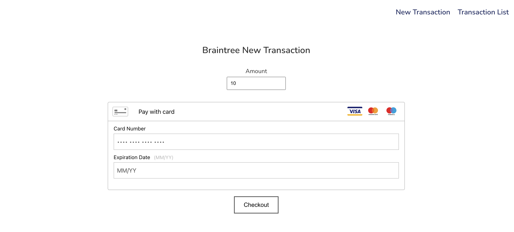
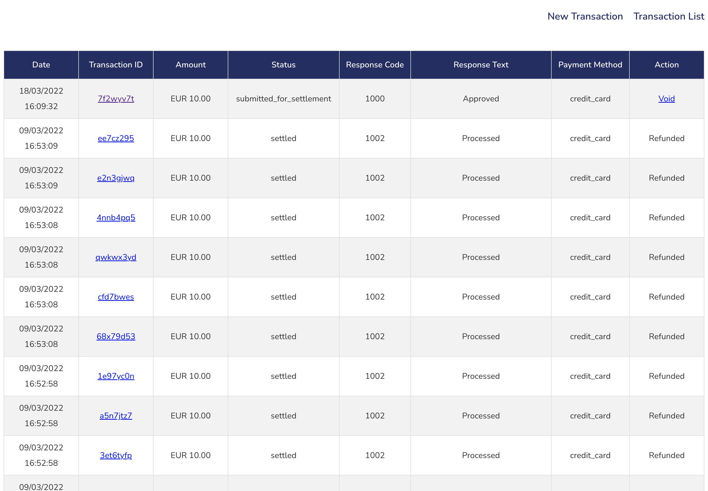
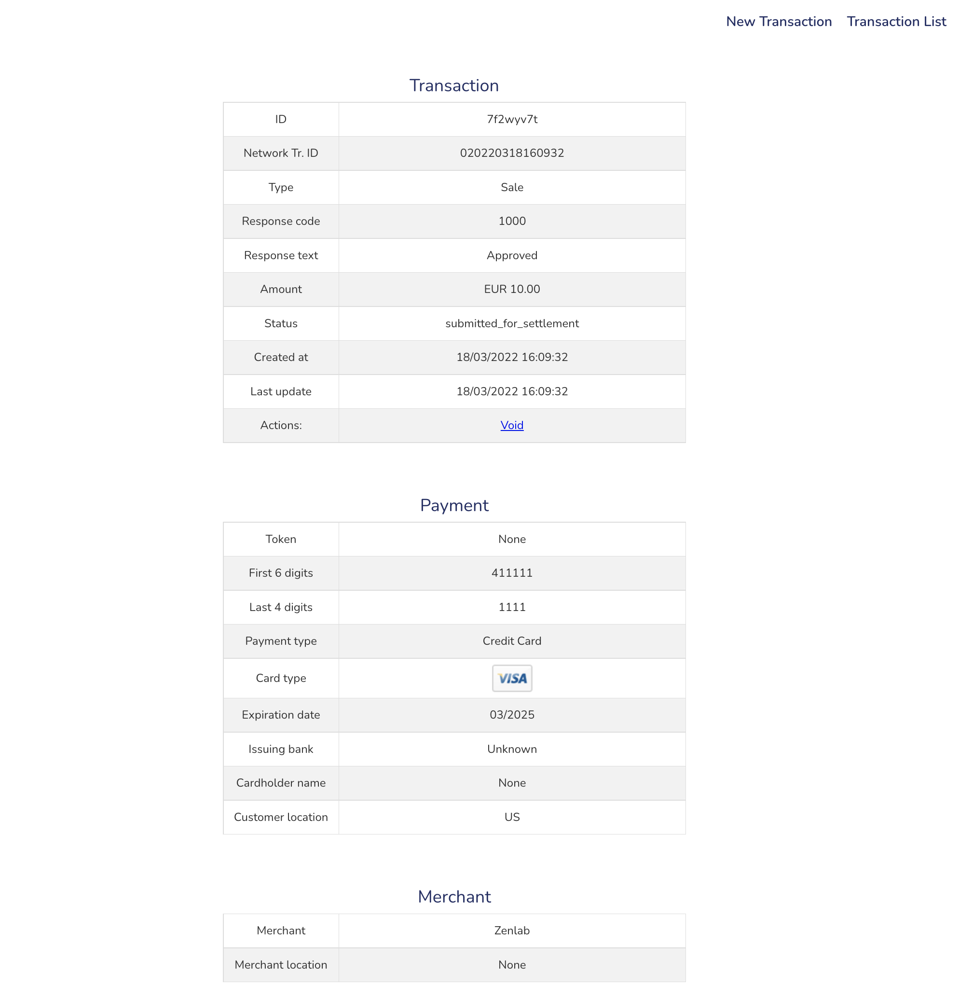

<h1 align="center">PayPal BrainTree Integration with Flask Framework</h1>

[View the live project here.](https://braintree-flask-integration.herokuapp.com/)

[Official documentation.](https://developer.paypal.com/braintree/docs/start/overview)

I created this application with Python / Flask framework to demostrate how you can integrate BrainTree payment gateway in your app or website by using Python SDK and BrainTree API.

Braintree is a PayPal Service and a full-stack payments platform that makes it easy to accept payments in your app or website. All kinds of organizations can use Braintree to accept payments in mobile apps and websites.

<p align="center">
  
</p>
<p align="center">
  
</p>
<p align="center">
  
</p>

## Technologies Used

### Features included in this project/webapp:

- Braintree Python SDK using SandBox for testing

- Enter a new transaction (Process a Sandbox payment)

- Show transaction details

- List all transactions (VISA only) 
- List includes: Date, Transcaction ID, Amount, Status, Response Code, Response Text, Payment Method, Action

- Actions you can take on a transaction: Void a transaction, refund a transaction, void a refund

### Languages Used
- [HTML5](https://en.wikipedia.org/wiki/HTML5)
- [CSS3](https://en.wikipedia.org/wiki/Cascading_Style_Sheets)
- [JavaScript](https://en.wikipedia.org/wiki/JavaScript)
- [Python](https://en.wikipedia.org/wiki/Python_(programming_language))

### Frameworks and Libraries
- [Flask Framework](https://palletsprojects.com/p/flask/)
- [BrainTree - Python SDK](https://developer.paypal.com/braintree/docs/start/hello-server/python)
- [BrainTree - Server-Side API Requests](https://developer.paypal.com/braintree/docs/reference/response/transaction)

You will need to use your own Merchant ID, Public Key, Private Key to interact with your Sandbox BrainTree account. 
Go to [Sandbox](https://sandbox.braintreegateway.com/), click on Settings at the top right (the gear icon), click on API, your account's details are right there. Replace these details in gateway/__ __init____.py 

## How to complete a test transaction in this webapp
- [Testing CC - Documentation](https://developer.paypal.com/braintree/docs/reference/general/testing): You can choose any credit card listed on the Testing webpage. Be aware that each test amount listed on the webpage will trigger the associated authorization response. Also be aware that my "Transaction List" page includes only payments issued by VISA, then choose a VISA CC if you would like to see your transaction details and interact with it.

## Tips and deployment

### How to set up your Python and Flask development environment
- [Install Flask](https://flask.palletsprojects.com/en/2.0.x/installation/): Follow these steps (just a few lines) to create a virtual environment and install Flask

- Install the requirements:
```
pip3 install -r requirements.txt
```

- [Flask Quickstart](https://flask.palletsprojects.com/en/2.0.x/quickstart/): Check this documentation if you are not familiar with Flask, this will be very helpful.

## How to Fork and Clone
### Forking the GitHub Repository

By forking the GitHub Repository we make a copy of the original repository on our GitHub account to view and/or make changes without affecting the original repository by using the following steps...

1. Log in to GitHub and locate the [GitHub Repository](https://github.com/Renato79/braintree-flask-python-integration)
2. At the top of the Repository (not top of page) just above the "Settings" Button on the menu, locate the "Fork" Button.
3. You should now have a copy of the original repository in your GitHub account.

### Making a Local Clone

1. Log in to GitHub and locate the [GitHub Repository](https://github.com/Renato79/braintree-flask-python-integration)
2. Under the repository name, click "Clone or download".
3. To clone the repository using HTTPS, under "Clone with HTTPS", copy the link.
4. Open Git Bash
5. Change the current working directory to the location where you want the cloned directory to be made.
6. Type `git clone`, and then paste the URL you copied in Step 3.

```
$ git clone https://github.com/Renato79/braintree-flask-python-integration/
```

7. Press Enter. Your local clone will be created.

```
$ git clone https://github.com/Renato79/braintree-flask-python-integration/
> Cloning into `CI-Clone`...
> remote: Counting objects: 10, done.
> remote: Compressing objects: 100% (8/8), done.
> remove: Total 10 (delta 1), reused 10 (delta 1)
> Unpacking objects: 100% (10/10), done.
```

Click [Here](https://help.github.com/en/github/creating-cloning-and-archiving-repositories/cloning-a-repository#cloning-a-repository-to-github-desktop) to retrieve pictures for some of the buttons and more detailed explanations of the above process.